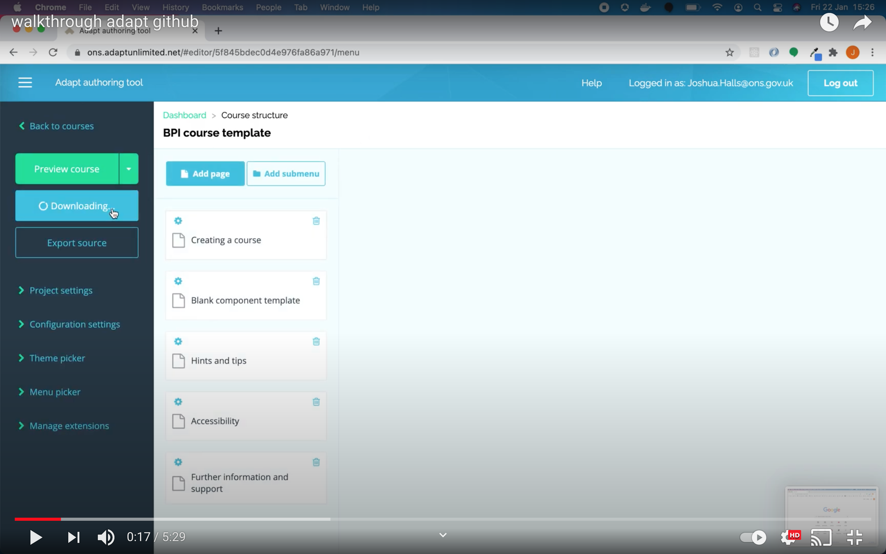

# How to publish Adapt Course 

Step by Step video guide
[](https://www.youtube.com/watch?v=plCjmYUIaVQ&feature=youtu.be)

## Steps

**Quick**
* Publish
* UnZIP
* GitHub Repo
* Push course to GitHub
* GitHub Pages

**Long**
* In the Adapt Authoring Tool select on the left hand side **Publish Course**
* This downloads a ZIP file of the course. UNZIP the folder. Right click on folder and select unzip
* Create a [GitHub repository](https://docs.github.com/en/github/getting-started-with-github/create-a-repo). You will need access to the BPI GitHub. 
* Open GitBash (or a different terminal if preferred). Go to the folder in GitBash, if you need help see [Navigating Folders](https://github.com/adaptlearning/adapt_authoring/wiki/Just-Enough-Command-Line-for-Installing). Then use the Git Command Line program to push content

  ```bash
  # Create Git project
  $ git init
  
  # Add the created GitHub repo to your local created git project
  # This line with the remote url can be copied from github
  $ git remote add origin  <REMOTE_URL> 
  
  # Add and commit your code so that git tracks the files
  $ git add .
  $ git commit -m "publish course"
  
  # Push course to GitHub
  $ git push origin master -u
  ```
* [Activate GitHub Pages](https://guides.github.com/features/pages/) for your GitHub Repository 
* Done!
  
## You Need
* Adapt Authoring Tool
* GitHub account
* Access [BPI GitHub](https://github.com/best-practice-and-impact). Ask anyone currently a member of the BPI GitHub organisation to add you
* Git and GitBash. This can be requested through Service Desk


